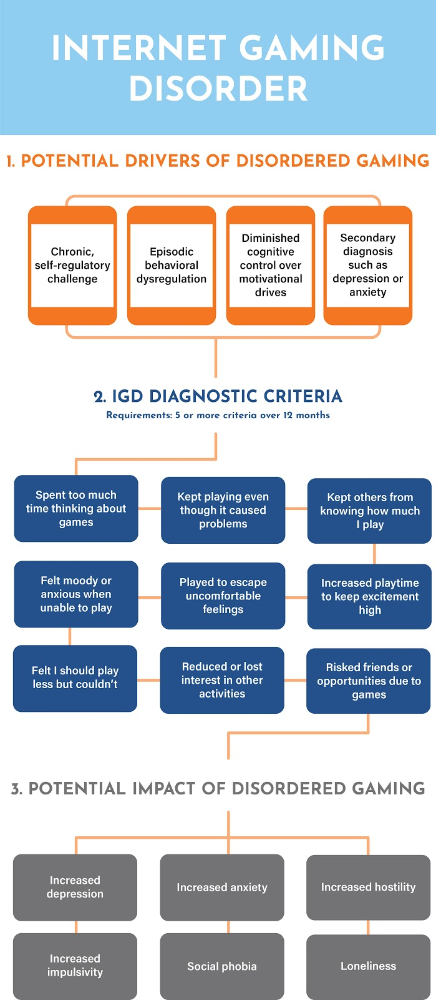

This morning, the NY Times posted an article entitled “[Can You Really Be Addicted to Video Games?](https://www.nytimes.com/2019/10/22/magazine/can-you-really-be-addicted-to-video-games.html)”. This article told the story of Charlie Bracke and his descent into video game addiction. This article is just one of many that have following the classification of Internet Gaming Disorder (IGD) by the World Health Organization in September 2018. While this, and other articles like it, make for interesting stories, they are often sensationalized, full of generalized claims, and do little to push the narrative forward about what the scientific community does and does not know about video game addiction.

To provide some clarity, this article will provide a summary of what the scientific community knows about the prevalence, diagnosis, and impact of IGD. Overall, there remains a lack of clarity about the connection between games themselves and disordered play.

## What is IGD?

In the most recent publication of the [Diagnostic and Statistical Manual of Mental Disorders](https://www.psychiatry.org/psychiatrists/practice/dsm) published by the American Psychiatric Association , Internet Gaming Disorder (IGD) was identified as a possible psychiatric condition. While there are still active debates about the best way to conceptualize and assess IGD (see [here](https://www.ncbi.nlm.nih.gov/pubmed/26669530), [here](https://www.ncbi.nlm.nih.gov/pubmed/25103106), and [here](https://www.ncbi.nlm.nih.gov/pubmed/24456155)), some standard practices have emerged from the literature. Specifically, IGD has come to be measured via a nine-item checklist, with the report of 5 or more of the nine criteria occurring over the previous year, plus an endorsement of personal distress due to Internet gaming indicating addiction. The nine criteria are as follows:

1. Spent too much time thinking about games.
2. Felt moody or anxious when unable to play.
3. Increased playtime to keep excitement high.
4. Felt that I should play less but couldn’t.
5. Kept playing even though it caused problems.
6. Kept others from knowing how much I play.
7. Played to escape uncomfortable feelings.
8. Reduced or lost interest in other activities.
9. Risked friends or opportunities due to games.

Whilst the wording may vary slightly across study, the assessment of IGD has consistently assessed themes of salience (video game play begins to dominate the player’s thoughts, emotions, and behavior), mood modification (the player experiences a change in mood because of video game play), conflict (the player begins to suffer negative interpersonal, occupational, and psychological consequences due to game play), tolerance (the player needs increasing amounts of play time to achieve the mood-modifying effects), withdrawal (when the player is unable to play they become frustrated and irritable) and relapse (players repeatedly fail to reduce their video game use).

There has been a lot of debate within the academic community about the vagueness of this diagnostic criteria (in fact, this is one of the [primary concerns from the scientific community about this diagnosis](https://www.ncbi.nlm.nih.gov/pmc/articles/PMC5700734/)). For example, if you replace the word “games” with another enjoyable activity that you often participate in - for example, dancing - you will likely find that you also meet the criteria for being “addicted” to that activity.

It is also important to point out that IGD and disordered (or pathological) gaming are not analogous terms. To qualify as clinically addicted, participants must meet the criteria as outlined above whereas the term problematic gaming is applied to players who meet some criteria, but not enough to reach the clinical threshold. The proposed cut-off of five of the nine DSM criteria was strategically chosen in the DSM-5 to [prevent low thresholds from inflating diagnoses and classifying individuals who have not suffered significant clinical impairment](https://www.ncbi.nlm.nih.gov/pubmed/24456155) (i.e., problematic gamers).

Prevalence rates of IGD within the general population have yet to be established making it difficult to determine the severity of the problem. A [2011 meta-analysis](https://www.sciencedirect.com/science/article/abs/pii/S0022395611001919) of 33 published studies and doctoral dissertations indicated an overall prevalence rate of 3.1%.

## What causes IGD?

One of the key debates surrounding IGD is understanding it’s the underlying cause. Is it as a chronic condition, like substance addiction? Or a self-regulatory challenge, like gambling addiction? This is something that is still being debated within scientific communities. However, it is generally understood that IGD likely is, at least partially, driven by diminished external factors, such as diminished cognitive control over motivational drives that contribute to [decision making skills](https://www.sciencedirect.com/science/article/abs/pii/S0022395614002027) or ["a need frustration" for our daily psychological needs](https://onlinelibrary.wiley.com/doi/abs/10.1111/cdev.13007).

## What does not cause IGD?

There is no scientific evidence indicating that games themselves are the motivating force behind any kind of dysregulated gaming behavior. While games are often specifically created to keep players engaged, there is no research indicating that the mechanisms within them are cultivating addictive behaviors.

The NY Times article pointed out the work in neuroscience that has indicated that compulsive game play and addictive drugs alter the brain’s reward circuits in similar ways. However, this is an overgeneralization of the research in this area.

For example, the amount of dopamine that is released in the “reward pathways” that are so often referred to, differs widely. As discussed by [Ferguson and Markey (2017)](https://www.nytimes.com/2017/04/01/opinion/sunday/video-games-arent-addictive.html),

> “Playing a video game or watching an amusing video on the internet causes roughly about as much dopamine to be released in your brain as eating a slice of pizza. By contrast, using a drug like methamphetamine can cause a level of dopamine release 10 times that or more. On its own, the fact that a pleasurable activity involves dopamine release tells us nothing about it.”

Additionally, video games activate much more than just pleasure pathways of the brain. [Palaus and colleagues (2017)](https://www.frontiersin.org/articles/10.3389/fnhum.2017.00248/full) found that games not only activate many areas in the brain (such as those involved in visual acuity, attention, and spatial memory), but can contribute to long-term growth in some of these areas. In this sense, games can exercise your brain “muscles” and alter them in positive ways.

## IGD and well-being

One of the primary reasons that some have pushed for a diagnosis of IGD is from the concern that IGD may undermine physical, social, and mental health in a variety of ways. The work examining the effects of IGD on well-being has been limited, as there have only been two longitudinal studies (i.e., research studies that follow the same people over time; see [here](https://www.sciencedirect.com/science/article/pii/S0747563210002116) and [here](https://onlinelibrary.wiley.com/doi/abs/10.1111/add.12016)) exploring the precursors and consequences of IGD.

To account for this gap in the research, researchers have been drawing inferences on the potential effects of IGD from the literature examining the effects of Internet Addiction and online game playing (non-disordered or addicted) on psychological well-being. This is problematic for several reasons. First, it is not prudent to generalize findings among non-disordered (or addicted) game playing populations to disordered game playing populations as they are likely to vary widely in their game playing history, current use, and various other demographic factors. Second, [Internet Addiction and Internet Gaming Disorder are distinctly different concepts](http://irep.ntu.ac.uk/id/eprint/25238/1/219867_PubSub2199_Pontes.pdf).

That said, examining the literature from Internet Addiction and online video game play research provides some insight into the potential impact IGD may be having on its players. Internet addiction and online video game play have been independently been associated with negative behavioral and psychological outcomes, including [depression](https://www.researchgate.net/profile/Murat_Iskender/publication/264550590_Internet_addiction_and_depression_anxiety_and_stress/links/549aa8ee0cf2d6581ab26eb7.pdf), [anxiety](https://www.liebertpub.com/doi/abs/10.1089/cyber.2012.0390), [hostility](https://www.sciencedirect.com/science/article/abs/pii/S1054139X07000936), [compulsivity](https://www.liebertpub.com/doi/abs/10.1089/109493103321640338), [social phobia](https://www.sciencedirect.com/science/article/abs/pii/S1054139X07000936), and [loneliness](https://www.liebertpub.com/doi/abs/10.1089/109493103321640338).

A smaller amount of cross-sectional research has emerged linking IGD to similar outcomes, including [depression](https://www.sciencedirect.com/science/article/pii/S0747563210002918) and [anxiety](https://www.liebertpub.com/doi/abs/10.1089/cyber.2009.0229) and other poorer mental health outcomes such as [lower self-esteem](https://www.sciencedirect.com/science/article/pii/S0747563210002918) and [life satisfaction](https://onlinelibrary.wiley.com/doi/abs/10.1111/add.12016).

The lack of studies examining the relationship between gaming, disordered gaming, and well-being outcomes grossly limits our understanding of IGD as a psychiatric condition. If IGD is to be retained as a diagnosable and treatable condition, clinicians, policy makers, educators, parents, and other professionals must be informed about the range and scope of its implications on players’ well-being. There is still a ways to go before IGD is fully understood in terms of its underlying causes and potential consequences.

## Concluding Thoughts

There will always be anecdotal stories about individuals who used games in a ways that impair their lives. However, putting the blame on the games without looking at other potential root causes does a disservice to that individual and the scientific community at large. We know that too much of anything can lead to negative consequences, that does not mean that the action itself is to blame. For example, we know that drinking too much water can lead to death but no one is clamoring for formal regulations on water consumption. The same is true for video games.

However, if we are ever going to generate a clear understanding of the impact of digital media on our well-being we need [more data, better science](https://www.theverge.com/2018/6/19/17479318/gaming-disorder-who-psychology-video-games-science), and to leave the moral panic narrative behind. As so eloquently stated by James Ivory of Virginia Tech University, [“Saying someone plays video games is like saying someone wears shoes”](https://www.nytimes.com/2019/08/05/sports/trump-violent-video-games-studies.html).

Video game play is ubiquitous.

Demonizing the activity itself hinders scientific progress.

Moving forward, we need to shift the narrative away from “games as the root problem” and towards understanding why some individuals may use games in disordered ways. Only then can we better understand these patterns of disordered use currently subsumed by the label “Internet Gaming Disorder”.
